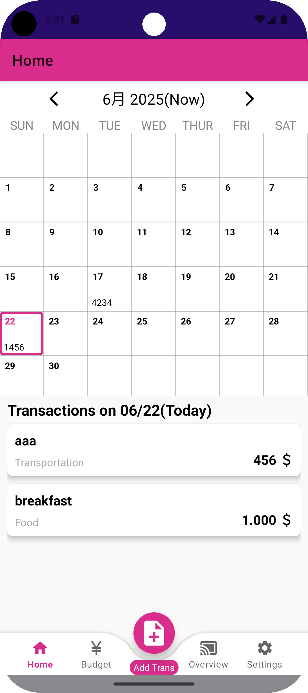
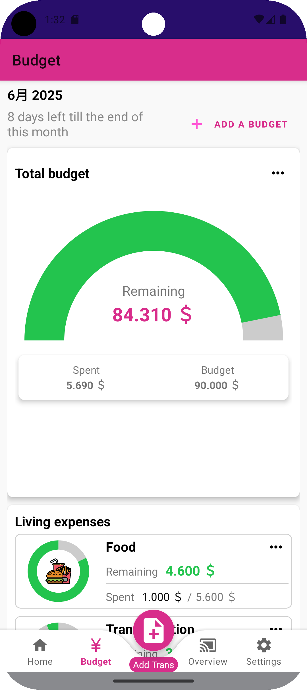
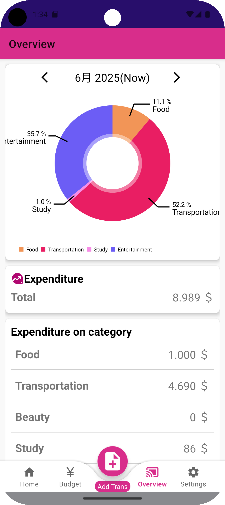
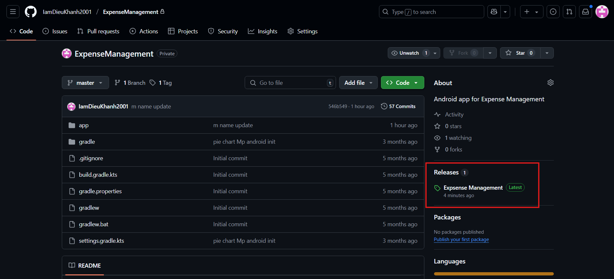

# Keihi kanri app - Personal Finance Manager

Keihi kanri app is a mobile-first personal finance application that helps you track expenses, analyze spending patterns, and achieve financial goals.

## Table of Contents
- [Features](#features)
- [Screenshots](#screenshots)
- [Installation](#installation)

## Current Features (Update more in future)
- 💸 **Expense Tracking**: Add expenses with categories
- 📊 **Data Visualization**: Interactive charts and reports
- 🎯 **Budget Management**: Set monthly budgets per category
- 🌍 **Supports language**: English, Japanese, Vietnamese

## Screenshots

  
  
  

## Installation
1. Get apk installation at github https://github.com/IamDieuKhanh2001/ExpenseManagement

  

